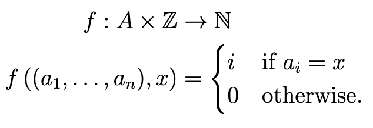
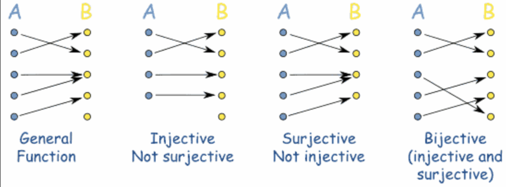

## 1 a) Explain why f is not a function using the list (3, 4, 4, 5) as an example. 
{ align=right }

Because a function is defined by having only 1 output, and if you give it this list and tell it to search for the number 4 it would output the index of 4 twice, since the number four exists twice.

## 1 b) If we require the lists we use to not have repeated elements, then f can be seen as a function (3, 4, 5). Decide whether this function is injective, surjective or bijective.

Then it must be injective because we don't get 2 results, which also means that there are always some that won't return.

{ align=center }

