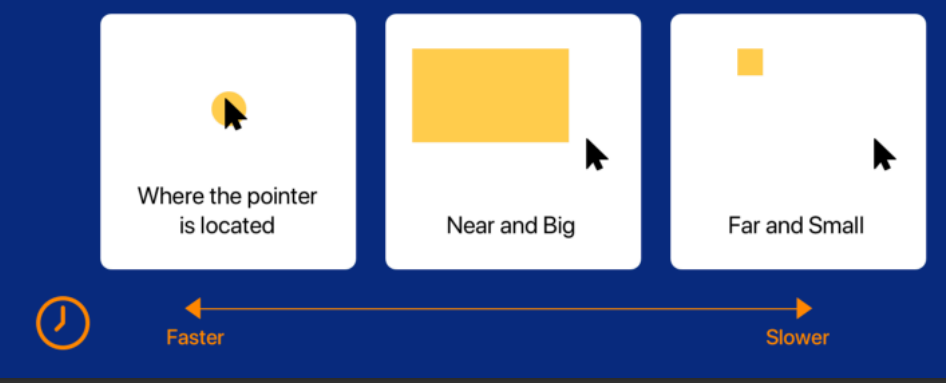

# What is it?

This course is about designing and making user interfaces that explain themselves
without the need of labels or cluttered.

The focus is on usability which means we should create interfaces effectively, efficient and to the satisfaction of users.

UX = User eXperience

use [FACTOR](https://uninotes.mantarias.com/3.%20Semester/System%20Development/lecture%201/#factor) or PACT

There are rules for minimal requirements for accessibility enforced by law

Fitts’s law is a mathematical formula which relates the time required to move to a target as a function of the distance to the target and the size of the target itself, say moving a pointer using a mouse to a particular button.

$$T(time to move) = k log2(D/S + 0.5)$$

D = distance

S = size

people can differ in:

* Physiological differences
    * Disabilities (blindness, motor control etc.)
    * Anthropometrics, measurement of a person, Finger size (male/female, thick/thin)
    * Ergonomic knowledge about the capacities of a person.
* Psychological differences
    *  Spatial abilities
    * Attention
    * Memory
    * Emotional disorders (depression)
    * Personality types
* Mental models
* Social differences
    * Motivation
    * Novice/Expert
    * Homogeneous groups
    * Heterogeneous groups
