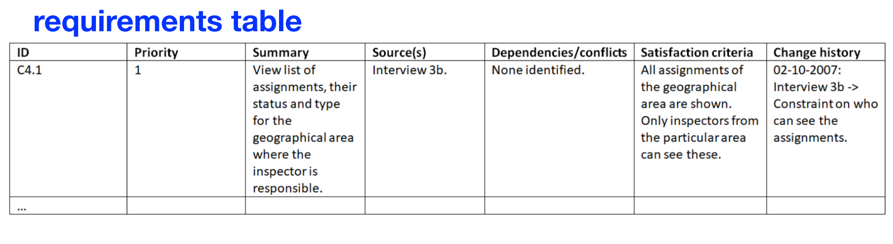
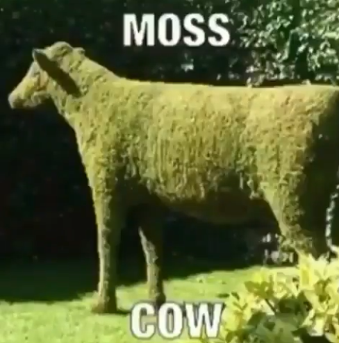

# Lecture 2

!!! Question "Requirements - Exercise 1"
    What types of requirements exist?

Functional and non-functional
!!! Question "Requirements - Exercise 2"

    What characterizes the different types of requirements?

functional is what a system must do and non-functional is what qualities the system must have

!!! Question "Requirements - Exercise 3"

    How can requirements be represented in a requirements specification? (would you use a table and what would that look like?)

using requirements table 

!!! Question "Requirements - Exercise 4"

    What characterizes a "good" requirement? How should a good requirement be phrased?

A requirement which is specific and doesn't leave any unanswered questions. 

!!! Question "Requirements - Exercise 5"

    How can requirements be prioritized?

using MoSCoW model

* Must have
* Should have
* Could have
* want to have, but won't at this time

!!! Question "Requirements - Exercise 6"

    Who decides which priority to give the requirements? And how is this decided?
    
stakeholders

!!! Question "Data Collection - Exercise 1"

    Which of the following are considered qualitative data collection methods?

    * Interviews

    * Questionnaires

    * Cultural probes

    * Observation

    Why?

Interviews and observations 

Interviews because you interview each person independently and adapt the interview to the specific person.

Observations because you observe what they do and can notice things which might not have been mentioned like them using hotkeys.

!!! Question "Data Collection - Exercise 2"

    Which of the following are considered quantitative data collection methods?

    - Interviews

    - Questionnaires

    - Cultural probes

    - Observation

    Why?

Questionaires are ussually limited in scope and sent to many people at once so you cant get much speciallized data out of them

!!! Question "Data Collection - Exercise 3"

    Which of the following can be considered both quantitative and qualitative data collection methods?

    - Interviews

    - Questionnaires

    - Cultural probes

    - Observation

    Why?

Cultural probes because it is a huge amount of data you need to piece together. Which might or might not get you what you need.

!!! Question "Data Collection - Exercise 4"

    What would be the best data collection method for gathering data in this situation: Your informants are part of a different community than your own. You want to get an understanding of their everyday lives and habits in using technologies at home. Which method of data collection techniques would be most suitable?

    * Interviews

    * Questionnaires

    * Cultural probes

    * Observation

    Why?

Interview and cultural probe and possible an observation. Because they are qualitative data and it is very specific data to them you want

!!! Question "Data Collection - Exercise 5"

    How many forms of interviews are there and how would you describe these?

Structured: Already pre-written questions

Semi-structured: Few pre-written questions and its allowed deviate from them

Unstructured: You ask questions as they come

!!! Question "Data Collection - Exercise 6"

    What are the benefits and drawbacks of the different interview forms?

Structured: You get the questions answered you feel are important, but might leave out questions that could lead to a better end product for the users/stakeholders

Semi-structured: might be too time-consuming. Else has benefits of both of them

Unstructured: questions might feel random, and you might seem ill prepared to the interviewed person. You will get answers to the important questions for the specific person.

!!! Question "Data Collection - Exercise 7"

    What are some considerations you should take into account in terms of the language of interview questions, i.e. formulating questions?

That it needs to be formal language. And precise in what the question formulation, so there is no guesswork in what you mean.

!!! Question "Data Collection - Exercise 8"

    What are some benefits of observations compared to interviews?

In interview the user might not tell you everything as they might be doing something unconsciously. But if you observe them you will be able to see that they might be using key binds to navigate the interface. 

!!! Question "Data Collection - Exercise 9"

    In which situations would it be most suitable to use questionnaires over interviews? 

when you need big amounts of data to find patterns

!!! Question "Data Collection - Case 1: Data gathering in a hospital ward"

    Imagine the following use context for a software system: Nurses and doctors work together in a hospital ward where children with serious illnesses (e.g. acute respiratory symptoms) are being treated. The ward is filled with technical equipment. The children come in with their parents, and the staff need to both treat the childrens’ health conditions and consult and update their systems with information while also calming the children and informing their parents about the procedures.

    You need to design a mobile app which shows a dashboard overview of data from various sensors (such as an electrocardiogram for monitoring heart rate). This is used to monitor the health of the children and warn staff about a change in physical conditions of the children in this use context. 

    1. Conduct a PACT-analysis of this scenario. 
    2. Which of the following data collection techniques would you find suitable for gaining an understanding of the use context? 
        * Interviews 
        * Focus group interviews
        * Questionnaires
        * Cultural probes
        * In situ observation
        * Artefact collection
        * Usability evaluation
    3. Why did you choose these data collection techniques? (strengths/weaknesses?)
    4. Who would you include in the data collection and in what activities?
    5. Are there any of the techniques that you would not use in this context and why not? 
    6. If you choose to conduct observations, which ethical issues would you consider in this specific situation?
    7. If you choose to conduct artefact collection, which ethical issues would you consider in this specific situation? 
    8. If you choose to interview a doctor, what practical considerations would you take into account?
    9. If you choose to interview a child, what practical considerations would you take into account? 