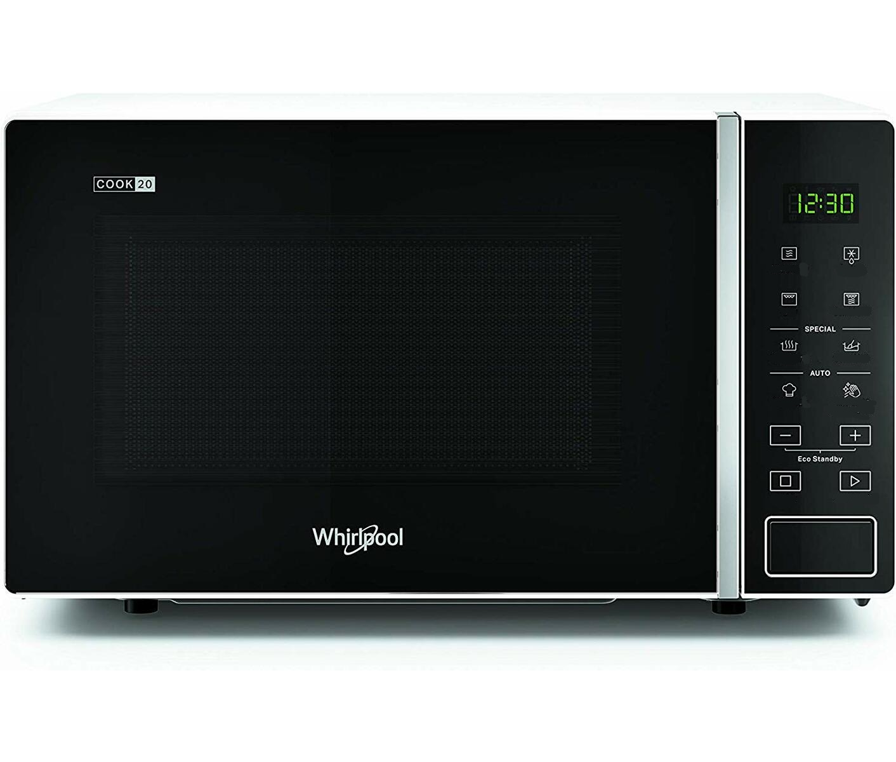

# Lecture 4

!!! Question "Physical Design - General Guidelines and Widgets Exercise 1"

    What is a design widget?

A small individual component you can interact with

!!! Question "Physical Design - General Guidelines and Widgets Exercise 2"

    List and explain 10 design widgets known from web application user interfaces.

* radio button: a round circle you can check there can only be one selected at a time
* multi select: checkmarks where you can select more than 1 element you can even select them all
* button: a generic button you can click and something happens
* link: a text you can click to be redirected.
* select box: a drop down menu where you can select a singular element.
* text box: a text box you can enter something into
* date select: a field where you can enter a date by clicking it. It opens up to let you click on different dates.
* password: a field which is hidden that lets you enter your password
* slider: a movable box on a line that lets you select an amount within range.
* Tooltip: A label or text box that
* Tab: Navigation tab that is used to organize data

!!! Question "Physical Design - General Guidelines and Widgets Exercise 3"

    List and explain (5-7 or more if you can) design widgets known from mobile user interfaces. 

* Notification banner: a banner which shows you notifications from your apps.
* text box: a text box you can enter something into
* slider: a movable box on a line that lets you select an amount within range.
* date select: a field where you can enter a date by clicking it. It opens up to let you click on different dates.
* time select : lets you swipe up and down to select specific time or time frame
* multi select: checkmarks where you can select more than 1 element you can even select them all
* select box: a drop-down menu where you can select a singular element.

!!! Question "Physical Design - General Guidelines and Widgets Exercise 4"

    Nielsen's heuristic "Consistency and Standards" states that user interface designers should express the same type of design elements (e.g. radio button widgets) in the same way across designs. This heuristic also implies that designed elements should conform to platform interface conventions. Which of the following notions is used to explain why humans can readily perceive the affordance of standardized design elements? (select one option and explain this concept).

    * Visual cues
    * Perceptual set
    * Interactivity

perceptual set it is what we can see what we can hear and what we can feel it is how we conceptualize the world.

!!! Question "Physical Design - General Guidelines and Widgets Exercise 5"

    Nielsen's heuristic "Match between system and the real world" states that the system should speak the users' language, with words, phrases, and concepts familiar to the user, rather than system-oriented terms.

    * Find examples of good design metaphors that borrow concepts from "the real world" (one example per group member).
    * Find examples of bad user interface design that fail to match system interactions with real-world concepts, leading to misinterpretation (one example per group member).
    * Discuss the examples in detail - what characterizes a good/bad design metaphor?
  

  

!!! Question "Physical Design - General Guidelines and Widgets Exercise 6"

    Nielsen's heuristic "Flexibility and efficiency of use" states a demand for less interactions that allow faster navigation.

    * In the group, find one example of an inflexible/inefficient system that requires unnecessary interactions.
    * Redesign the user interface in order to optimize the flexibility and efficiency of the system.

!!! Question "Physical Design - General Guidelines and Widgets Exercise 7"

    Find a system that you find to be a badly designed system (could for instance be the same system you chose for the exercise in the DEB1 session).

    * List specific design elements that do not adhere to Jakob Nielsen's heuristics and argue why that is the case.
    * List specific design elements that do not adhere to Petrie and Powers' heuristics and argue why that is the case.

!!! Question "Physical Design - General Guidelines and Widgets Exercise 8"

    Redesign the specific design elements from exercise 7 such that the specific design elements now adhere to Nielsen's and Petrie & Powers' guidelines. Use Balsamiq to make the improved designs.

 

!!! Question "Physical Design - General Guidelines and Widgets Exercise 9"

    Consider the Whirlpool Microwave oven in the picture.

    

    * According to your own interpretation, list the functionality underlying each of the icons
    * Compare your interpretations to the real meanings of the icons (don't look at this before you've listed your own interpretations): Link to correct funtionality
    * Apply Hortons icon checklist to redesign the icons that you misinterpreted
