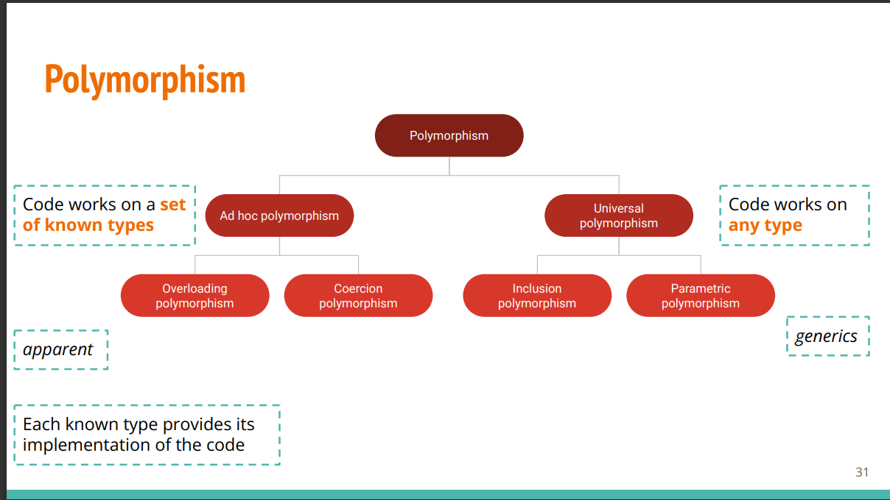

# What is it?
!!! links

    [API Documentation](https://docs.oracle.com/en/java/javase/17/docs/api/index.html)

    [The Java Language Specification](https://docs.oracle.com/javase/specs/jls/se17/html/index.html)

| Topic           | Description                                                                                                           |
|-----------------|-----------------------------------------------------------------------------------------------------------------------|
| State           | How we represent an instance of an object. States are variables but inside a class. States are mostly private and is only modifiable via methods, that way they are protected from malicious access.       |
| Behaviors/Methods| Interactions with objects work through methods. they are functions but inside a class, they interact with a specific instance of a class unless a static method is used. Methods are within classes and interact with the object.                                                                          |
| Paradigm        | The basic programming unit of OOP are objects. Functions are side-effect free.  Command is a statement.|
| Abstraction     | Focus on essential details. Programs decomposed into smaller, understandable subprograms. Which means that there are a lot of hidden implementations, such as the easy conversion between array and list.       |
| Encapsulation   | Combines data and operations in an entity. For example a class contains data and operations into an entity.                                          |
| Inheritance     | Derive new types that are more specialized. Supertype is a generalization of subtype, and subtype is a specialization of the supertype.      |
| Polymorphism    | Behavior depends on context. Allows for reusability and maintainability. Works for all subtypes, allows implicit conversions, and can be parameterized.    |

