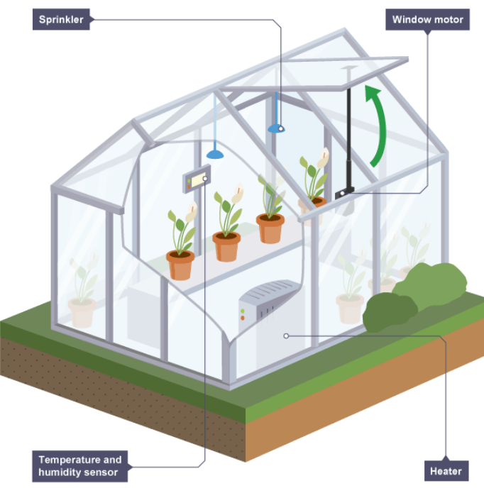
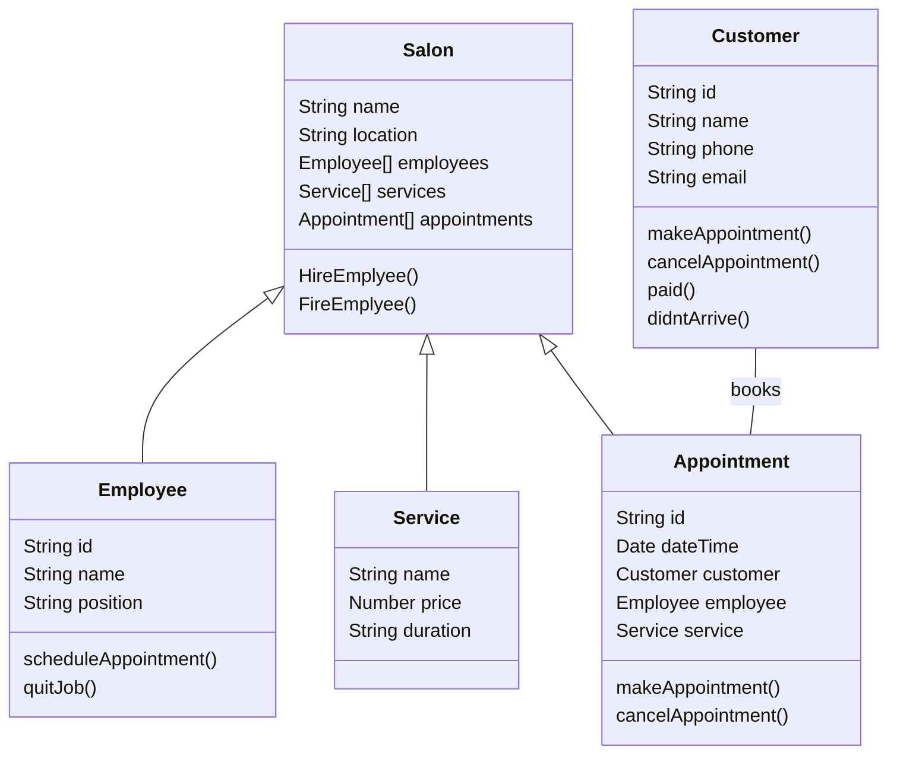
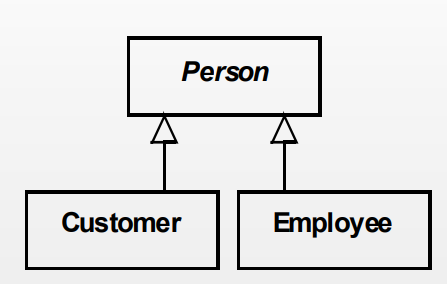
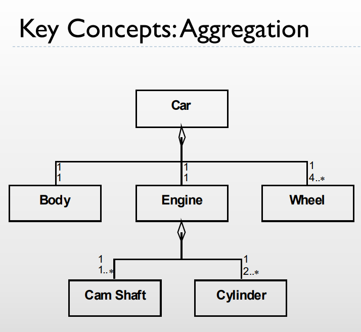
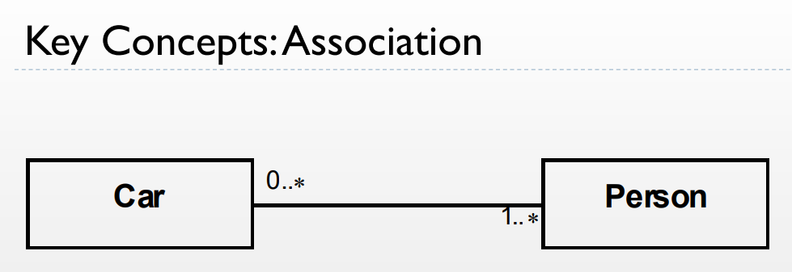
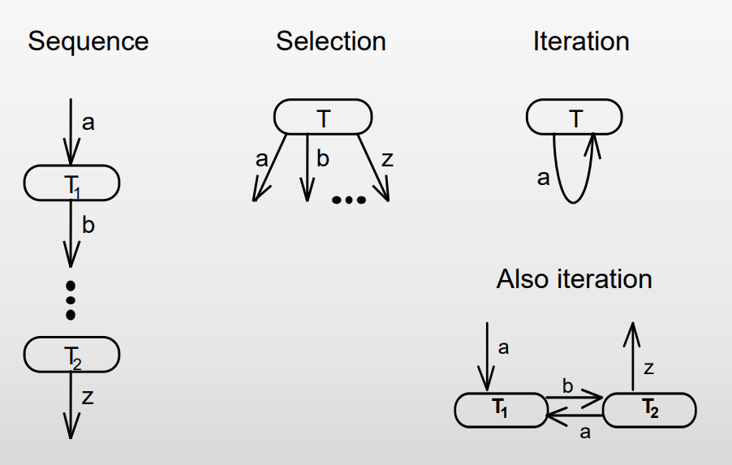
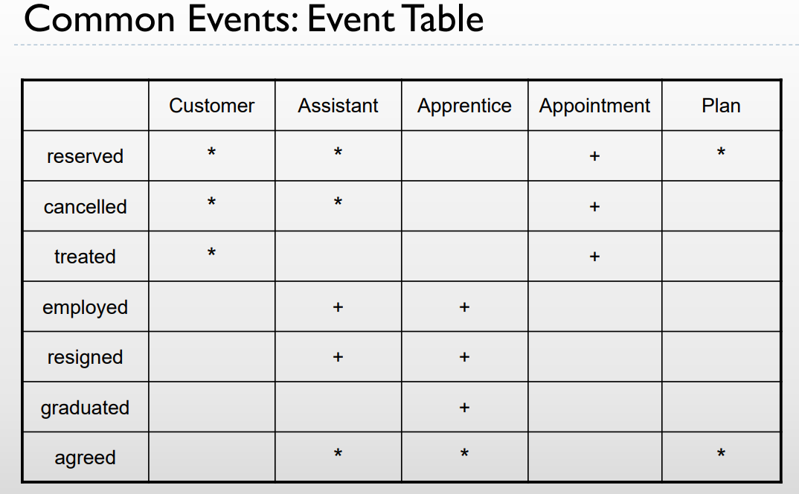

# What is it?

It is basically a way of working with and designing bigger systems/applications.

The way this class works by trying to design systems in various ways.

!!! Abstract

    the point with this class is to use oop programming effectively by understanding classes and using object for different aspects of your application

## Terms
| Topic          | Description                                                                                   |
|----------------|-----------------------------------------------------------------------------------------------|
| Analysis       | Understanding a system in its context and conditions for implementation.                       |
| Design         | Create a theoretical system without many unknown/uncertainties as possible.                    |
| Implementation | Realize a design on a technical platform = programming/setting up the physical objects.         |
| Method         | The method can be multiple things, water fall and iterative ??? Needs more text.               |
| Granularity    | How accurate does the system need to be.                                                       |

!!! Example

    Lets say we have 2 systems. System 1 needs to keep track of items and system 2 just needs to work with piles of dirt. In system one it is very important every object has its own unique id, but in system two we dont need an id for each rock, if the piles have an id that would be good enough. This is because individual rocks wont ever need a unique id so why spare the resources for one, whilst the items do need their own because they will get shipped out to different adresses.

Problem Domain = the problem we want solved

Application Domain = the tools we can use to solve the problem

# Examples

    Problem Domain

        the greenhouse and its temperature

    Application Domain = mantinance?

        gardener 

Object 
And entity with state identity and behavior

Class
A collection describing objects with common behavior and attributes

Teacher:
vare betalt
vare genopfyldt
vare fundet
medarbejder mødtind
medarbejder tagethjem

Hair Salon

{== Classes
    
    Salon
    
    customer
    
    location
    
    Haircut

    worker

==}

{== Events instantaneous incident involving one or more objects not a method needs to be instantly registered by the system.
    
    timeReserved
    
    paid
    
    arrived
    
    gotHaircut
    
    gotHairWashed
==}

customer is a subclass of person and so is employee superclass is written with cursive also known as generalization

‘has ‐a’ or ‘owns ‐a’ relation (more common)

example 1 car has 4 wheels or more 

number ..* means the amount before the number as minimum and more cause dot dot star

cant be changed

loose non-defining relation example 1 or more persons can have 0 or more cars

can be changed

control structure of behavior 

\+ means 0 or once * means it can happen many times