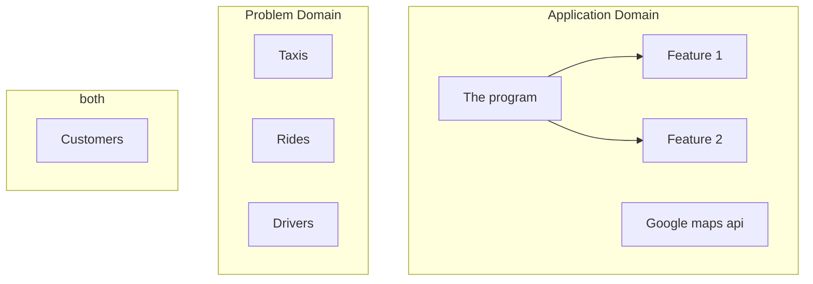

# Lecture 1

!!! exercise

    Aalborg Taxi want a new system for administering and monitoring their taxis, drivers, customers and taxi rides. Describe in text the problem domain and application domain of such a system.
## application domain

The application domain would the objects/users needed to solve this issue, which in this case would be:

## problem domain

The problem domain would be the things/drivers/people we want to organize and move around

taxis, drivers, customers and taxi rides


!!! exercise

    Are the taxis, drivers, customers and taxi rides in the application domain, the problem domain or both? Why?
Look above

!!! exercise

    Make a system definition for the Taxi System. The system definition must comply with the FACTOR-criterion.
```
F = Functionality (The system functions that support the application domain tasks)

A = Application domain (Those parts of an organization that administrate, monitor, or control a problem domain) 

C = Conditions (The conditions under which the system will be developed and used) 

T = Technology (Both the technology used to develop the system and the technology on which the system will run) 

O = Objects (The main objects in the problem domain) 

R = Responsibility (The system’s overall responsibility in relation to its context) 

These elements describe the most fundamental decisions involved in creating a sound computerized solution. 
```

| Acronym                | Description                                                                                                                                                                                                                       |
| ------------------------ | ----------------------------------------------------------------------------------------------------------------------------------------------------------------------------------------------------------------------------------- |
| F (Functionality)      | The system will enable the management of taxis, drivers, and customers, offer real-time tracking of rides, and calculate fares.                                                                                                   |
| A (Application Domain) | The system is intended for Aalborg Taxi, a taxi service company, to administer and monitor their fleet of taxis, drivers, and customers.                                                                                          |
| C (Conditions)         | The system will be developed in phases with iterative feedback from the taxi company who test it internally (scrum), and will be used as a prototype which then should get turned into a real product with enough itterations.    |
| T (Technology)         | The system will be web based application with html, css, and javascript as the front end. The backend will be done in java which then also integrates with a database both running on linux in a container, for easy scalability. |
| O (Objects)            | The main objects in the problem domain are taxis, drivers, customers, and taxi rides.                                                                                                                                             |
| R (Responsibility)     | The system’s overall responsibility is to effectively and efficiently manage, track, and monitor the company’s taxis, drivers, customers, and rides.                                                                            |

!!! exercise

    Make a radically different system definition for the Taxi System. The system definition must comply with the FACTOR-criterion. Compare with the first one; what are the differences.

| Acronym                | Description                                                                                                                                                                       |
| ------------------------ | ----------------------------------------------------------------------------------------------------------------------------------------------------------------------------------- |
| F (Functionality)      | The system will be able to actively track cars, customers, and prices. It will be an app for customers to order rides and monitor where their ordered car is, somewhat like uber. |
| A (Application Domain) | The system is intended for custumers, to order taxis.                                                                                                                             |
| C (Conditions)         | The system will be developed with the waterfall method, and will be used as a full prototype which then can be used as a reference point for an actual application.               |
| T (Technology)         | The system will be written fully in rust, for the ui qt will be used as it has a rust wrapper avalable.                                                                           |
| O (Objects)            | The main objects in the problem domain are taxis, customers, and taxi rides.                                                                                                      |
| R (Responsibility)     | The system’s overall responsibility is to effectively and efficiently, track the customers ride.                                                                                 |
