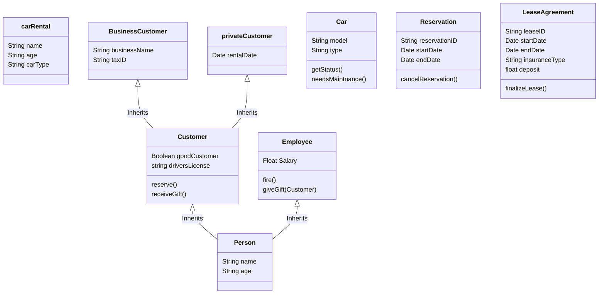

# Lecture 2

We chose Kaj’s Cars

!!! Classes

    customer
    
    car
    
    employe
    
    reservation
!!! Events

    Reserve
    
    Payment method

# Car Rental

| Event | Description |   
| ------------- | -------------| 
|reserve()| Reserves a car|   
|receiveGift()| When a customer receives a gift from Kaj's Cars|
|giveGift()| When Kaj's Cars decides to give giftes to customer|
|finalizeLease()|Agree upon the leasing agreement|
|cancelReservation()| Cancel a reservation|
|fire()| Fire an employee|
|needsMaintenance()| If a car have been damaged or needs maintenance in any way|

| Class Name       | Description      |
|------------------|------------------|
| carRental        | keeps info about who borrows a car and cars type                 |
| Customer         | base class for customer keeps their payment information inherits from person                 |
| privateCustomer  |there was a destinction between private and BusinessCustomer which is why we need two seperate classes|
| BusinessCustomer |there was a destinction between private and BusinessCustomer which is why we need two seperate classes|
| Car              |we need to store cars such as millages, model, and other information|
| Employee         | keeps employee info like salary and gives the ability to give gifts to good customers                 |
| Reservation      | Reservation is going to be a form anyways so why not just create a class|
| LeaseAgreement   | We need to be able to create a lot of these agreements which is why creating a class for it is useful as it allows us to store all of them easely|
