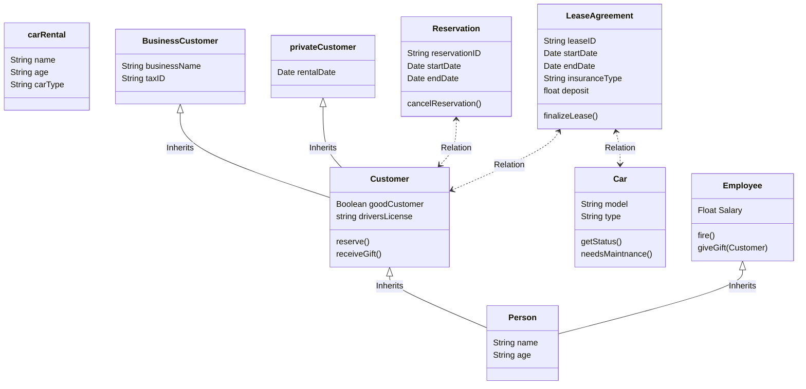
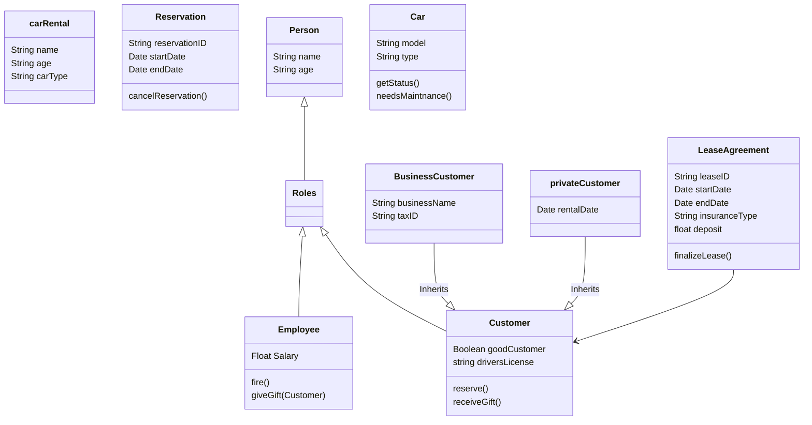

# Lecture 3

!!! Question

    Find candidates for structural relations between the classes in your event table - do this pair by pair

!!! Question
     
     Explore if any of the patterns are relevant to your case - do this for each class

| Class Name       | Description      |
|------------------|------------------|
| carRental        ||
| Customer         |Hierarchy|
| privateCustomer  |Hierarchy|
| BusinessCustomer |Hierarchy|
| Car              ||
| Employee         |Hierarchy|
| Reservation      ||
| LeaseAgreement   ||
| person | Hierarchy, roles|

!!! Question
    
    Make a class diagram

See question 1!

!!! Question

    Look for opportunities to simplify and extend the class diagram

incorporate roles

