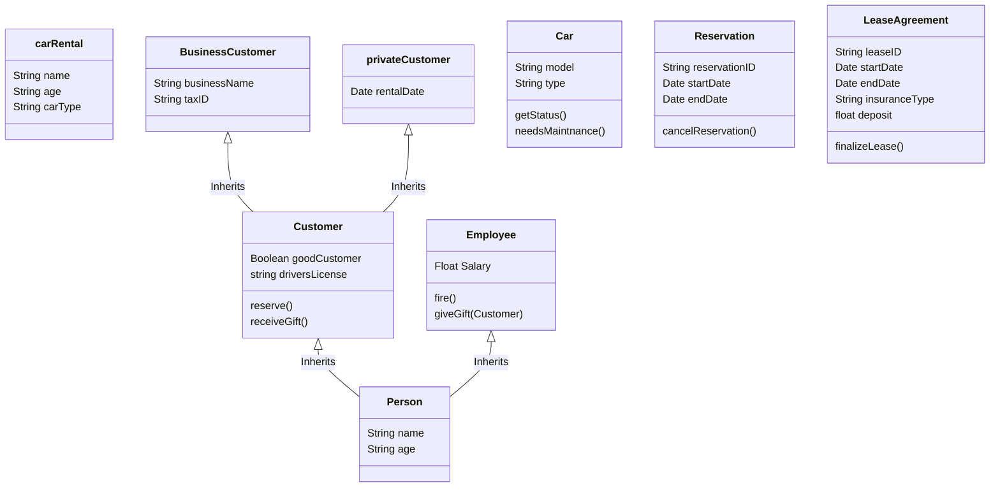

# Lecture 4



!!! Question
    Start with event traces for the simple classes


```mermaid
graph TD
  %% Styling nodes
  style car fill:#f9f,stroke:#333,stroke-width:2px

  %% Subgraph for car
  subgraph car
    a1[Car Status]
    a2[Get Me]
  end

  %% Defining relations
  a1 --|getStatus| a1
  a1 --|getMe| a2

```

!!! Question
    Describe behavioural patterns from the event traces


!!! Question 
    Continue with the more complex classes


!!! Question
    If the behavioural pattern becomes too complicated, consider using the stepwise role or stepwise relation pattern – this introduces new classes


!!! Question 
    Make sure there are behavioural patterns that control sequence and some that don’t (structured/unstructured)


!!! Question 
    Add attributes to classes and events


!!! Question 
    Check the behavioural patterns against the class diagram

    