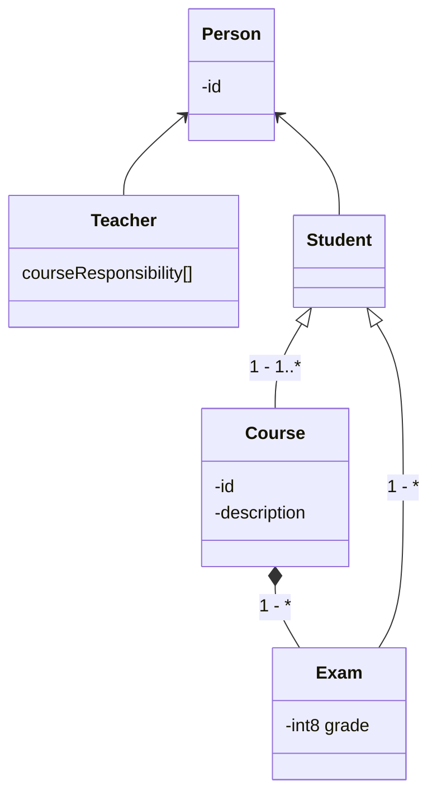

# Lecture 6
!!! Question
    Teaching administration. Consider a system for monitoring student activities in a university department. The department offers its students courses and thesis projects. Each course follows one of several course descriptions. Courses and thesis projects are evaluated through graded exams. The department must track all its activities, the teachers responsible for the activity, the student participating in the activity, and the results of the activity exams. 
    
    Add details and assumptions as needed and address the following problems. List class candidates in the teaching administration system. List event candidates in the teaching administration system. Evaluate the candidates systematically and produce the resulting event table.

!!! Question 
    Teaching administration. Continue your considerations of the system for monitoring student activities in a university department (see Exercise 3.15). Develop a complete list of functional requirements by systematically examining the model and use cases.

!!! Question 
    Elevator control. Continue your considerations of the system to control elevator movement in a building (see Exercise 3.16). Develop a complete list of functional requirements by systematically examining the model and use cases.

