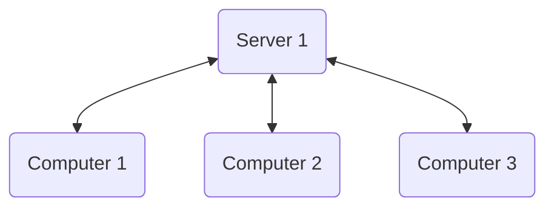

# 1. Internet and Web-programming.
- Internet/Network (dns, ips, bluetooth, transfer protocols)
- Web programming (js, browsers, api)

## Basic intro :material-server:
- Security is an huge ongoing issue.
- Time to get a package from a remote server is way slower than getting something from a local network, and both your own and a local computer is way faster at making calculations compared to something in a remote location.
- Most systems are built using a backend:octicons-rocket-16: and front:fontawesome-brands-js: end system.

