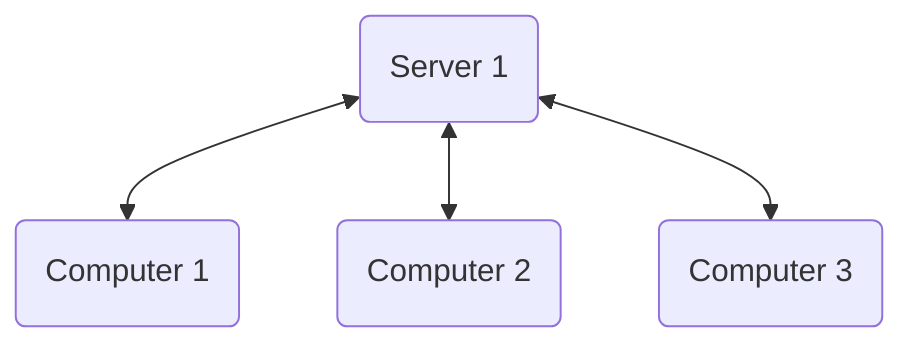

# 1. Internet and Web-programming.
- Internet/Network (dns, ips, bluetooth, transfer protocols)
- Web programming (js, browsers, api)

## Basic intro :material-server:
- Security is an huge ongoing issue.
- Time to get a package from a remote server is way slower than getting something from a local network, and both your own and a local computer is way faster at making calculations compared to something in a remote location.
- Most systems are built using a backend:octicons-rocket-16: and front:fontawesome-brands-js: end system.
- HTML5, CSS, and JavaScript
    * HTML5 is a markup language used to structure and display content on the web. 
    * CSS is a stylesheet language used to specify the look and layout of web content. 
    * JavaScript is a programming language used to add interactivity and dynamic behavior to web pages. 

## Important Reminders.
### Terms
- browser = user-agent
- Client = Front-end
- Server-side = Back-end

### Notes
requests are made using HTTP protocol
webpages can be modified both css html and js at run time

