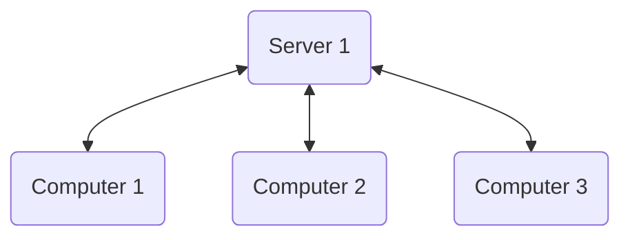

# 1. Internet and Web-programming.
- Internet/Network (dns, ips, bluetooth, transfer protocols)
- Web programming (js, browsers, api)

## Moodle page:
[https://www.moodle.aau.dk/course/view.php?id=46692#section-1](https://www.moodle.aau.dk/course/view.php?id=46692#section-1
)


## Basic intro :material-server:
- Security is an huge ongoing issue.
- Time to get a package from a remote server is way slower than getting something from a local network, and both your own and a local computer is way faster at making calculations compared to something in a remote location.
- Most systems are built using a backend:octicons-rocket-16: and front:fontawesome-brands-js: end system.
- HTML5, CSS, and JavaScript
    * HTML5 is a markup language used to structure and display content on the web. 
    * CSS is a stylesheet language used to specify the look and layout of web content. 
    * JavaScript is a programming language used to add interactivity and dynamic behavior to web pages. 




### let vs var
In JavaScript, var and let are used to declare variables, but they have some differences in scope and hoisting:

1. Scope: var variables have function scope, which means they are accessible within the entire function in which they are declared. On the other hand, let and const variables have block scope, which means they are only accessible within the block in which they are declared.

2. Hoisting: Variables declared with var are hoisted to the top of their scope, which means that they are accessible before they are declared in the code. let and const variables are not hoisted, which means that they are only accessible within the block in which they are declared and not before.

Scope example:
```js
// Block scope example
if (true) {
  let blockScopeVariable = "I am block scoped";
  console.log(blockScopeVariable); // "I am block scoped"
}
console.log(blockScopeVariable); // ReferenceError: blockScopeVariable is not defined

// Function scope example
function myFunction() {
  var functionScopeVariable = "I am function scoped";
  console.log(functionScopeVariable); // "I am function scoped"
}
myFunction();
console.log(functionScopeVariable); // ReferenceError: functionScopeVariable is not defined
```


## Important Reminders.
### Terms
!!! terms
- browser = user-agent
- Client = Front-end
- Server-side = Back-end
- localhost ip = 127.0.0.1:%port%

### Notes
requests are made using HTTP protocol
webpages can be modified both css html and js at run time

