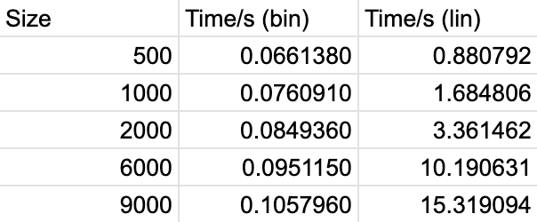
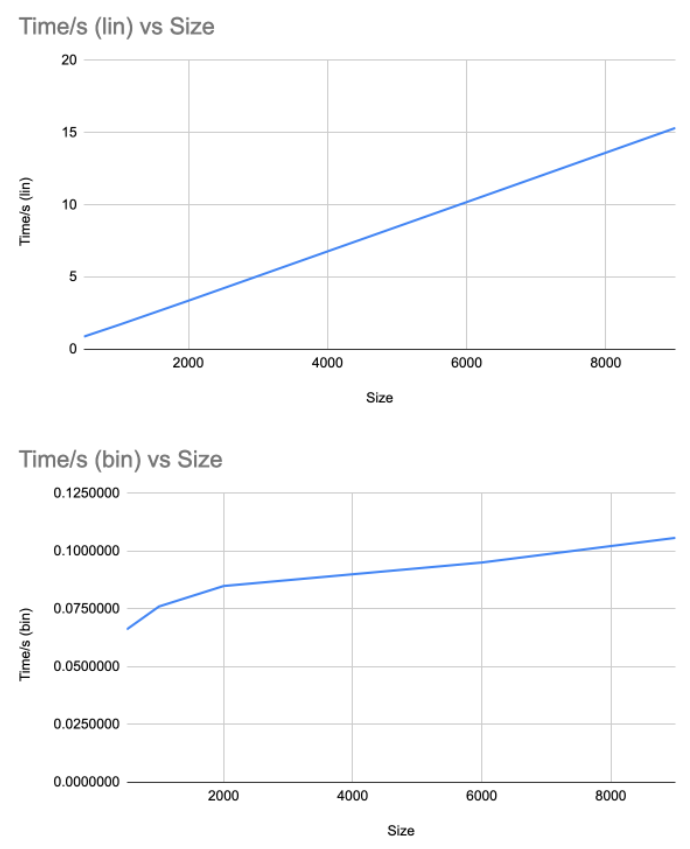

!!! info

    We will now study two such algorithms, linear search and binary search.  
    Note that to use the binary search algorithm we need the list (a1, . . . , an) to be sorted.


## a) Implement the two algorithms in the provided file SearchCompare.c.
```c
// procedure: LinearSearch(x: element, (a1, a2 , . . . , an): list)
int i = 0;  
/* Fill in your code HERE! */  
while (i <= N - 1 && x != array[i]) {  
    i++;  
}  
if (i <= N-1) {  
    return i;  
} else {  
    return -1;  
}
```

```c
// Procedure: BinarySearch(x: element, (a1, a2, . . . , an): list)
int i = 0;  
/* Fill in your code HERE */  
int j = N;  
int m;  
  
while (i < j) {  
    m = (i + j) / 2;  
    if (x > array[m]) {  
        i = m + 1;  
    } else {  
        j = m;  
    }  
}  
if (x == array[i]) {  
    return i;  
}else {  
    return -1;  
}
```

## b) Check if the element 7000 appears in the lists List500.txt, List1000.txt, List2000.txt, List4000.txt, and List9000.txt.

!!! info

    The code provided runs each algorithm 1 Million times and measures the time they take.

7000 does not exist in any of the lists, which means we can use it as a benchmark for the different Algorithms at their worst performance.


## c) Take note of how long the algorithms take for the different lists and plot list size on the x-axis and the time it took on the y-axis

Binary search is faster than linear search because it uses the ordered nature of our data, to eliminate half of the remaining elements as a possible solution each time, reducing the number of comparisons needed to find an element, **from O(n) to O(log n)** which makes it faster for large arrays.


{ align=center }
{ align=center }

