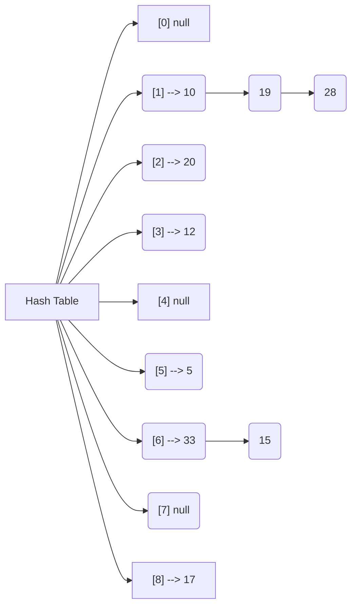

# Lecture 07

## exercise 1

[CLRS-3 11.1-1] Suppose that a dynamic set S is represented by a direct-address table T of length m. Describe a procedure that finds the maximum element of S . What is the worst-case performance of your procedure?

To find the highest element of S you would look at it from behind till you find an element.

worse case O(m) as you would need to check every cell.

## exericise 2

[CLRS-3 11.2-2] Demonstrate what happens when one inserts the keys 5; 28; 19; 15; 20; 33; 12; 17; 10 into a hash table with collisions resolved by chaining. Let the table have 9 slots, and let the hash function be h(k) = k mod 9.

## exercise 3 
[CLRS-3 11.4-1] Consider inserting the keys 10; 22; 31; 4; 15; 28; 17; 88; 59 into a hash table of length m = 11 using open addressing with the auxiliary function h ′(k) = k. Illustrate the result of inserting these keys using linear probing, using quadratic probing with c1 = 1 and c2 = 3, and using double hashing with h1(k) = k and h2(k) = 1 + (k mod (m − 1)).

## exercise 4

[CLRS-3 11.4-3] Consider an open-address hash table with uniform hashing. Give upper bounds on the expected number of probes in an unsuccessful search and on the expected number of probes in a successful search when the load factor is 3/4 and when it is 7/8.

!!! teachers answer

    By Theorem 11.6 in CLRS, the expected number of probes in an unsuccessful search is bounded by 1/(1 − α). Thus, for α = 3/4 we have 1/(1 − α) = 4, and for α = 7/8 we have 1/(1 − α) = 8. By Theorem 11.8 in CLRS, the expected number of probes in a successful search is bounded by(1/α) ln(1/1 − α). Hence, for α = 3/4 we have (1/α) ln(1/1 − α) = (4/3) ln 4 ∼= 1.85, and for α = 7/8 we have (1/α) ln(1/1 − α) = (8/7) ln 8 ∼= 2.38.

