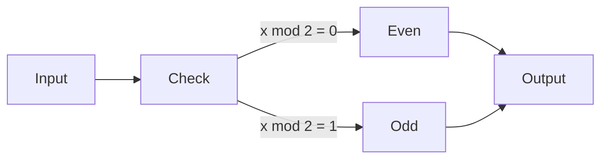
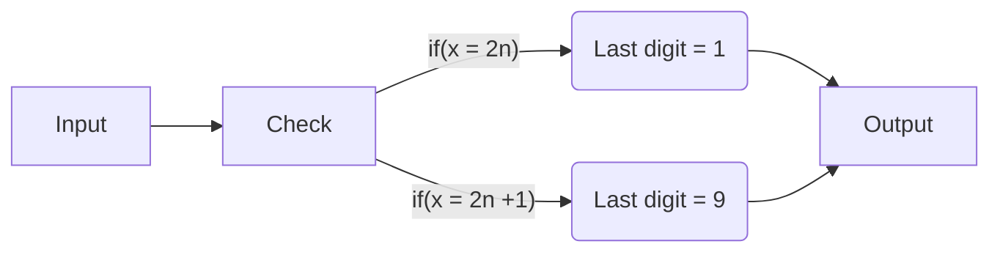

## 1. Prove the following theorem: Let x be a positive integer. It holds that gcd(x, 2) = 1 if and only if x is odd.



Proof that x is odd when gcd(x,2) = 1

* If we have x = 2n + 1 (and odd number) the remainder will always be 1 when we devide it by 2, because 2 can never devide an odd number without using floating points.


Proof that x is even when gcd(x,2) = 0

* If we have x = 2n (and even number) the remainder will always be 0 when we devide it by 2, because 2 can always devide an even number. 
!!! ps 
    Euclidean algorithm

## 2. Prove the following theorem: Let x be a positive integer. It holds that 9 x − 2 mod 5 = 2 is equivalent to x being odd.


* if you put 9 to power of an even number like 9^2n^ the last digit will always be 1
* if x is an odd number x = 2n +1 then 9^x^ will always end with the last digit 9, as 1 * 9 is 9.
* 9 to the power of anything will always end up with either the number 1 or the number 9.
* when 9 is to power of an odd number and we look at last digit this will be true(9-2)%5==2.
* when 9 is to an even number like 2 9^2^ == (81-2)%5==2 is false as it is == 4.
* as it only alternates between those 2 digits depending if its even or odd we can use this to check if the number is even




!!! info

    it will always alternate between 1 and 9.


## 3. Explain why the previous theorems show that Q(x) and R(x) are the same function. Hence we can replace R(x) with Q(x) in (1) and show that it is equivalent to:
```
(P (x) ∧ ¬Q(x)) ∨ ¬(P (x) ∨ ¬Q(x) ∨ Q(x)) ∨ (¬P (x) ∧ ¬Q(x) ∧ Q(x))
≡(P (x) ∧ ¬Q(x)) ∨ ¬(P (x) ∨ T) ∨ (¬P (x) ∧ F)
≡P (x) ∧ ¬Q(x)
```

1. If we look at the 2 graphs below we can see that you can see that they are same
2. in the first graph if x is a odd number, we get the digit 9 and if its even we get 1, which will in turn return either true if it is 1 or false if it is 9.

3. On the other graph we see the exact same thing, if its even get 0, and if its odd we get 1, which just translate into true and false.

4. So thiese functions basically only check if a number is odd or if it is even making them equivalent.


## Check if (2) is in CNF, DNF, PCNF and PDNF.
```
(P (x) ∧ ¬Q(x)) ∨ ¬(P (x) ∨ ¬Q(x) ∨ Q(x)) ∨ (¬P (x) ∧ ¬Q(x) ∧ Q(x))
≡(P (x) ∧ ¬Q(x)) ∨ ¬(P (x) ∨ T) ∨ (¬P (x) ∧ F)
≡P (x) ∧ ¬Q(x)
```

The given statement is in conjunctive normal form (CNF) which is a conjunction(∧) of one or more clauses (P(x) "∧" ¬Q(x))


!!! example

    P(x) "∧" ¬Q(x) = CNF

    P(x) "∨" ¬Q(x) = DNF

    "(P ∨ Q)" ∧ "(P ∨ ¬Q)" = PCNF

    "(P ∧ Q)" ∨ "(P ∧ ¬Q)" = PDNF

    (P ∨ Q) ∧ "(P)" = CNF because there is no second (clause)
    
    (P ∧ Q) ∨ "(P)" = DNF because there is no second (clause)

